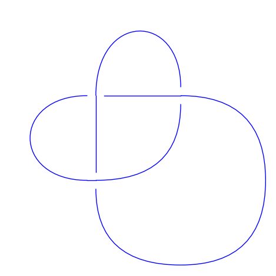

# SageMath interface to the KnotInfo and LinkInfo databases

##  Talk at the LKS-Seminar, University of Regensburg, 18.03.2021


### What is SageMath?

 
[Wikipedia page](https://en.wikipedia.org/wiki/SageMath)

[Internet site](http://www.sagemath.org/)

[Online calculator](https://sagecell.sagemath.org/), a *Sage Version* of [WolframAlpha](https://www.wolframalpha.com/)

[CoCalc](https://cocalc.com/app?anonymous=sagews&utm_source=sagemath.org&utm_medium=landingpage), a commercial colaboration platform.


### Knots, links and braids in SageMath

[Reference manual](https://doc.sagemath.org/html/en/reference/knots/index.html)
[as pdf](https://doc.sagemath.org/pdf/en/reference/knots/knots.pdf)

Mostly native implementation but using  [libbraiding](https://github.com/miguelmarco/libbraiding), [libhomfly](https://github.com/miguelmarco/libhomfly) for the braid class and many other interfaces indirectly, for example [Gap](http://www.gap-system.org) (for the braid group, as well) but also interfaces for graph theory, polynomial rings or plotting.


#### Link construction using  `pd_code`:


```python
L3 = Link([[1, 5, 2, 4], [5, 3, 6, 2], [3, 1, 4, 6]])
L3.plot()
```





#### using `braid_notation`:


```python
B = BraidGroup(4)
b = B([-1, -1, -1, -2, 1, -2, 3, -2])
Lb = Link(b)
Lb.plot()
```


Links can also be constructed from *oriented Gauss code*.

### Knots


```python
K3 = Knot([[1, 5, 2, 4], [5, 3, 6, 2], [3, 1, 4, 6]])
K3 == L3
```


    False


```python
sage: L3.is_isotopic(K3)
```


    True


#### Some special things only apply to knots:


```python
unicode_art(K3)
```


     ╭─╮ 
     │╭│╮
    ╭─│╯│
    │╰╯ │
    ╰───╯


```python
unicode_art(L3)
```


    Link with 1 component represented by 3 crossings


In addition to the construction methods for links, knots can be obtained using *classical Gauss code* or the *Dowker-Thistlethwaite code*.

#### If the input represents a proper link:


```python
Kb = Knot(b)
```


    ---------------------------------------------------------------------------

    ValueError                                Traceback (most recent call last)

    <ipython-input-7-7b0f31ae2c42> in <module>
    ----> 1 Kb = Knot(b)
    

    ~/devel/sage/local/lib/python3.6/site-packages/sage/misc/lazy_import.pyx in sage.misc.lazy_import.LazyImport.__call__ (build/cythonized/sage/misc/lazy_import.c:4032)()
        358             True
        359         """
    --> 360         return self.get_object()(*args, **kwds)
        361 
        362     def __repr__(self):


    ~/devel/sage/local/lib/python3.6/site-packages/sage/misc/classcall_metaclass.pyx in sage.misc.classcall_metaclass.ClasscallMetaclass.__call__ (build/cythonized/sage/misc/classcall_metaclass.c:1761)()
        320         """
        321         if cls.classcall is not None:
    --> 322             return cls.classcall(cls, *args, **kwds)
        323         else:
        324             # Fast version of type.__call__(cls, *args, **kwds)


    ~/devel/sage/local/lib/python3.6/site-packages/sage/knots/knot.py in __classcall_private__(self, data, check)
         93             <class 'sage.knots.knot.Knots_with_category.element_class'>
         94         """
    ---> 95         return Knots().element_class(data, check=check)
         96 
         97     def __init__(self, data, check=True):


    ~/devel/sage/local/lib/python3.6/site-packages/sage/misc/classcall_metaclass.pyx in sage.misc.classcall_metaclass.ClasscallMetaclass.__call__ (build/cythonized/sage/misc/classcall_metaclass.c:1786)()
        323         else:
        324             # Fast version of type.__call__(cls, *args, **kwds)
    --> 325             return (<PyTypeObject*>type).tp_call(cls, args, kwds)
        326 
        327     def __get__(cls, instance, owner):


    ~/devel/sage/local/lib/python3.6/site-packages/sage/knots/knot.py in __init__(self, data, check)
        121         if check:
        122             if self.number_of_components() != 1:
    --> 123                 raise ValueError("the input has more than 1 connected "
        124                                  "component")
        125 


    ValueError: the input has more than 1 connected component


### Further examples


```python
h = L3.homfly_polynomial(); h
```


    -L^4 + L^2*M^2 - 2*L^2


```python
h.parent()
```


    Multivariate Laurent Polynomial Ring in L, M over Integer Ring


```python
type(h)
```


    <class 'sage.rings.polynomial.laurent_polynomial.LaurentPolynomial_mpair'>


```python
h == K3.homfly_polynomial()
```


    True


```python
h.factor()
```


    (L^2) * (-L^2 + M^2 - 2)


```python
L3kh = L3.khovanov_homology(); L3kh
```


    {-9: {-3: Z},
     -7: {-3: 0, -2: C2},
     -5: {-3: 0, -2: Z, -1: 0, 0: 0},
     -3: {-3: 0, -2: 0, -1: 0, 0: Z},
     -1: {0: Z}}


```python
br = L3.braid(); br
```


    s^-3


```python
B = br.parent(); B
```


    Braid group on 2 strands


```python
br.burau_matrix()
```


    [           -t^-2 + t^-1         t^-2 - t^-1 + 1]
    [     t^-3 - t^-2 + t^-1 -t^-3 + t^-2 - t^-1 + 1]


```python
_.parent()
```


    Full MatrixSpace of 2 by 2 dense matrices over Univariate Laurent Polynomial Ring in t over Integer Ring


### How to access knots and links in Sage by name?

Internally there is just a small list of Knots from the Rolfsen Table:


```python
K10_165 = Knots().from_table(10, 165)
K10_165m = K10_165.mirror_image()
K10_165.is_isotopic(K10_165m)
```


    False


More links can be defined by name if the optional package Snappy is installed:


```python
import snappy
K10_166 = snappy.Link('10_166').sage_link()
K10_166.is_isotopic(K10_165m)
```

    Plink failed to import tkinter.


    /home/sebastian/devel/sage/local/lib/python3.6/site-packages/snappy/snap/shapes.py:4: DeprecationWarning: the complex_field module is deprecated, please use sage.rings.complex_mpfr
    See http://trac.sagemath.org/24483 for details.
      from sage.rings.complex_field import ComplexField
    /home/sebastian/devel/sage/local/lib/python3.6/site-packages/snappy/verify/verifyCanonical.py:6: DeprecationWarning: the complex_number module is deprecated, please use sage.rings.complex_mpfr
    See http://trac.sagemath.org/24483 for details.
      from .squareExtensions import find_shapes_as_complex_sqrt_lin_combinations


    True


## That's new: Access to the KnotInfo and LinkInfo databases

[KnotInfo website](https://knotinfo.org/), [LinkInfo website](https://https://link-info-repo.onrender.com/)


[Trac-Ticket](https://trac.sagemath.org/ticket/30352)

[new reference manual](file:///home/sebastian/devel/sage/local/share/doc/sage/html/en/reference/knots/index.html)
[as pdf](https://gitlab.com/soehms/sagemath-knotinfo/-/blob/master/pdf_references_partial/knots.pdf)

[Additionals](https://gitlab.com/soehms/sagemath-knotinfo/-/blob/master/README.md)


Lets have a look at some of the examples:

### Declaration using list selection (tab-completion)


```python
L6 = KnotInfo.L6a4_0_0
L6pd = L6.pd_notation(); L6pd
```


    [[6, 1, 7, 2],
     [12, 8, 9, 7],
     [4, 12, 1, 11],
     [10, 5, 11, 6],
     [8, 4, 5, 3],
     [2, 9, 3, 10]]


The default behavior of the methods of the `KnotInfo` class is to convert the string from the original table to a Sage or python object:


```python
type(L6pd)
```


    <class 'list'>


To obtain the original string from the table you have to use the keyword `original`:


```python
L6.pd_notation(original=True)
```


    '{{6, 1, 7, 2}, {12, 8, 9, 7}, {4, 12, 1, 11}, {10, 5, 11, 6}, {8, 4, 5, 3}, {2, 9, 3, 10}}'


```python
type(_)
```


    <class 'str'>


```python
L6.is_knot()
```


    False


```python
L6.num_components()
```


    3


### Knots need a prefix `K`


```python
K4 = KnotInfo.K4_1
K4.is_amphicheiral()
```


    True


### Declaring a link directly by its internal name


```python
KnotInfo.K5_1.inject()
K5_1.dt_notation()
```

    Defining K5_1


    [6, 8, 10, 2, 4]


### Obtaining a link by its original name


```python
KnotInfo('L6a1{1}').inject()
L6a1_1.is_alternating()
```

    Defining L6a1_1


    True


### Obtaining Sage (and SnaPy) instances 


```python
L6.braid()
```


    (s0*s1^-1)^3


```python
_.parent()
```


    Braid group on 3 strands


```python
L6.link()
```


    Link with 3 components represented by 6 crossings


```python
_.alexander_polynomial()
```


    t^-2 - 4*t^-1 + 6 - 4*t + t^2


```python
l6s = L6.link(snappy=True); l6s # snappy temporarily not working in 9.3.beta8 
```


    <Link: 3 comp; 6 cross>


### Conversion methods

KnotInfo and LinkInfo list more than 120 properties (in sum). Not all of them have already conversion methods to Sage. At the moment this holds for about a quarter of them including all polynomial invariants:


```python
L6.homfly_polynomial()
```


    -v^2*z^2 + z^4 + 2*z^2 + v^2*z^-2 - v^-2*z^2 - 2*z^-2 + v^-2*z^-2


```python
_.parent()
```


    Multivariate Laurent Polynomial Ring in v, z over Integer Ring


**Everyone is invited to extend the amount of conversions!** But anyway, as a string all properties can be obtained, right now:


```python
K4[K4.items.arc_index]
```


    '6'


### Launching web pages


```python
L6.diagram()
L6.knot_atlas_webpage()
L6.items.jones_polynomial.description_webpage()
```


    True


```python
listg3 = [K for K in KnotInfo if K.is_knot() and K.crossing_number() < 9 and K.three_genus() == 3]
len(listg3)
```


    10


```python
any(K.inject() for K in listg3)
K7_1.is_alternating() == K8_10.is_alternating()
```

    Defining K7_1
    Defining K8_2
    Defining K8_5
    Defining K8_7
    Defining K8_9
    Defining K8_10
    Defining K8_16
    Defining K8_17
    Defining K8_18
    Defining K8_19


    True


```python
all(K.diagram() for K in listg3)
```


    True


### From Sage to KnotInfo


```python
L = Link([[3,1,2,4], [8,9,1,7], [5,6,7,3], [4,18,6,5],
          [17,19,8,18], [9,10,11,14], [10,12,13,11],
          [12,19,15,13], [20,16,14,15], [16,20,17,2]])
L.get_knotinfo()
```


    (<KnotInfo.K0_1: '0_1'>, None)


```python
K10_165.get_knotinfo()
```


    (<KnotInfo.K10_165: '10_165'>, True)


#### KnotInfoSeries


```python
KnotInfoSeries?
```


```python
KnotInfoSeries(10, True, True).inject()
for i in range(160, 166):
    K = K10(i)
    k = K.link(K.items.name, snappy=True)
    print(k, '--->', k.sage_link().get_knotinfo())
```

    Defining K10
    <Link 10_160: 1 comp; 10 cross> ---> (<KnotInfo.K10_160: '10_160'>, True)
    <Link 10_161: 1 comp; 10 cross> ---> (<KnotInfo.K10_161: '10_161'>, False)
    <Link 10_162: 1 comp; 10 cross> ---> (<KnotInfo.K10_161: '10_161'>, True)
    <Link 10_163: 1 comp; 10 cross> ---> (<KnotInfo.K10_162: '10_162'>, True)
    <Link 10_164: 1 comp; 10 cross> ---> (<KnotInfo.K10_163: '10_163'>, True)
    <Link 10_165: 1 comp; 10 cross> ---> (<KnotInfo.K10_164: '10_164'>, True)


```python
import snappy
snappy.Link('10_166').sage_link().get_knotinfo()
```


    (<KnotInfo.K10_165: '10_165'>, False)


### What does `# optional - snappy`  and `# optional - database_knotinfo` mean in the examples of the reference manual?

This is needed in the development proccess. After each commit which is pushed to the repository all examples are automatically tested by *patchbots*. The examples marked as *optional* prevent the patchbot to do that if the corresponding package is not installed.

Conversely this means that all examples which are not marked like this will be tested permanently on further development of Sage. They are perfomed on a subset of 20 links and about 20 properties hold statically in the Sage library for demonstration purpose. This prevents the interface to run out of compatibility.

## How can you use KnotInfo in Sage?

As soon as the enhancement ticket will be released (hopefully with version 9.3) it will be very easy. The demonstration cases will be shipped with the binaries of Sage. The complete Database can be installed typing

```
sage -i database_knotinfo
```

in a comand line. Before it is released you can use Docker:

```
docker run -it soehms/my_sagemath:knotinfo_and_snappy
```

or build Sage from source code together with the ticket branch. If you need help, please don't hesitate to contact me.

# Thank You!


```python

```
