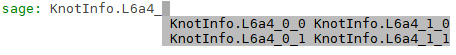

# SageMath interface to the KnotInfo and LinkInfo databases


## Introduction

### Instructions for use

This tutorial comes as a [Jupyter notebook](https://en.wikipedia.org/wiki/Project_Jupyter) 
([ipynb](https://github.com/soehms/database_knotinfo/blob/main/tutorials/sage_knotinfo_interface_tutorial.ipynb)) that may have been exported to a [pdf](https://github.com/soehms/database_knotinfo/blob/main/tutorials/sage_knotinfo_interface_tutorial.pdf), [html](https://github.com/soehms/database_knotinfo/blob/main/tutorials/sage_knotinfo_interface_tutorial.html), [md](https://github.com/soehms/database_knotinfo/blob/main/tutorials/sage_knotinfo_interface_tutorial.md) or a [sage](https://github.com/soehms/database_knotinfo/blob/main/tutorials/sage_knotinfo_interface_tutorial.sage)-file. The purpose of the `html`, `md` and `pdf` formats is for reading only. But, if you're using it in a [Jupyter client](https://docs.jupyter.org/en/latest/start/index.html) (i.e. the `ipynb`-version) you may experiment with the examples by running the appropriate cells.

#### Working with the Jupyter notebook

##### Using your local device

If you have a [SageMath](https://en.wikipedia.org/wiki/SageMath) distribution with a version of at least 9.4 then you can also run the cells of this tutorial on your own computer. To do this, enter

```
sage -n
```

in a bash shell located in a directory where you downloaded the `sage_knotinfo_interface_tutorial.ipynb` file (or rather the entire contents of the folder containing this file, so that local links work). This will open a new tab in your default browser showing the contents of that directory. Clicking on the tutorial file there will open another tab showing the file in a Jupyter client.

Note, that some of the examples require optional packages (as explained in the context of the examples). These examples will fail unless you install the corresponding package.

If you don't have a running Sage version of 9.4 (or newer) on your computer and are considering installing it, please see the [installation instructions](https://doc.sagemath.org/html/en/installation/index.html).

#####  Using Notebook Player

You can run all cells that don't rely on optional packages in the [Notebook Player](https://dahn-research.eu/nbplayer/). To do this first download the `ipynb`  file. Then use the *Browse*-Button of the *Notebook Player* to select the file from your local device.

##### Using Docker

If you don't want to install Sage on your machine but have [Docker](https://en.wikipedia.org/wiki/Docker_(software)) on it, you can run all cells of this notebook (including those depending on optional packages) after entering

```
docker run -p8888:8888 -w /home/sage/tutorials soehms/sagemath_knots:latest sage-jupyter
```

and following the instructions shown in the shell to open it in your browser. For more information see the [Docker repository](https://hub.docker.com/r/soehms/sagemath_knots).


##### Using Gitpod

Open [this pinned and shared](https://sagemath-sage-vvjhs5sv7yz.ws-eu77.gitpod.io/) [Gitpod workspace](https://gitpod.io/) in your browser (this may take some minutes). Then click on the *Open File* menu and select `/workspace/sage/tutorials/sage_knotinfo_interface_tutorial.ipynb`. After the notebook has opened select the *SageMath* kernel in the right top corner of the sheet (see the screenshots on [this page](https://soehms.github.io/gitpod_workspaces.html)). As for the Docker image you may run all cells of the notebook, here.

You're welcome to make your own experiments there. However, be aware that you share this workspace with others. Thus, please make a copy of the original file for this (for example by saving it under a different name).


#### Working in the command-line


##### Using your local device

You can also copy-paste the contents of the cells into a [Sage command line](https://doc.sagemath.org/html/en/reference/repl/index.html) session if the Sage version is at least 9.4. If you just want to use the tutorial examples for your own experiments then you can import its variables by loading the corresponding `sage` file, that is

```
sage: load('https://raw.githubusercontent.com/soehms/database_knotinfo/main/tutorials/sage_knotinfo_interface_tutorial.sage')
```

If this fails with a `FeatureNotPresentError` error install the missing optional packages or use the reduced version of the file:

```
sage: load('https://raw.githubusercontent.com/soehms/database_knotinfo/main/tutorials/sage_knotinfo_interface_tutorial_reduced.sage')
```


##### Using SageMathCell

If you don't want to install Sage on your machine you can also run most of the examples in the [SageMathCell](https://sagecell.sagemath.org/). To pre-define the variables of this tutorial evaluate first

```
load('https://raw.githubusercontent.com/soehms/database_knotinfo/main/tutorials/sage_knotinfo_interface_tutorial_reduced.sage')
```


##### Using Docker

You can also use the above Docker image to run all examples in a Sage command line by typing

```
docker run -it soehms/sagemath_knots:latest
```

To have the variable declarations of the tutorial available load the `sage_interface_knotinfo_tutorial.sage` file as described above. For more information see the [Docker repository](https://hub.docker.com/r/soehms/sagemath_knots).


##### Using Gitpod

The command line version can also be used in the terminal of the [Gitpod workspace](https://gitpod.io/start/#sagemath-sage-vvjhs5sv7yz). This is similar as for the Docker case.


### About

This tutorial is about a [class](https://doc.sagemath.org/html/en/reference/knots/sage/knots/knotinfo.html) from the [SageMath](http://www.sagemath.org/) library which is available since [release 9.4](https://wiki.sagemath.org/ReleaseTours/sage-9.4). It implements an [interface to the databases](https://doc.sagemath.org/html/en/reference/databases/sage/databases/knotinfo_db.html) provided at the web-pages [KnotInfo](https://knotinfo.org/) and [LinkInfo](https://link-info-repo.onrender.com/) which contain a classification of [mathematically knots and links](https://en.wikipedia.org/wiki/Knot_(mathematics)).

The tutorial follows a [talk](https://github.com/soehms/database_knotinfo/blob/main/tutorials/introduction_knotinfo.md) held at the LKS-Seminar, University of Regensburg, on 2021/03/18


## Knots, links and braids in SageMath

[Reference manual](https://doc.sagemath.org/html/en/reference/knots/index.html)
[as pdf](https://doc.sagemath.org/pdf/en/reference/knots/knots.pdf)

Sage has a mostly native [implementation of knots](https://doc.sagemath.org/html/en/reference/knots/sage/knots/knot.html) and [links](https://doc.sagemath.org/html/en/reference/knots/sage/knots/link.html) but also uses some third party software for this as [libbraiding](https://github.com/miguelmarco/libbraiding) and [libhomfly](https://github.com/miguelmarco/libhomfly) for the [braid group class](https://doc.sagemath.org/html/en/reference/groups/sage/groups/braid.html). Furthermore, many other interfaces are used indirectly, for example [Gap](http://www.gap-system.org) (for the braid group, as well) but also interfaces for graph theory, polynomial rings or plotting.


### Links

#### [Construction](https://doc.sagemath.org/html/en/reference/knots/sage/knots/link.html#sage.knots.link.Link)

Links can be constructed using  [pd_code](https://doc.sagemath.org/html/en/reference/knots/sage/knots/link.html#sage.knots.link.Link.pd_code):


```python
L3 = Link([[1, 5, 2, 4], [5, 3, 6, 2], [3, 1, 4, 6]])
L3.plot()
```


    

    


#### using [braid_notation](https://doc.sagemath.org/html/en/reference/knots/sage/knots/link.html#sage.knots.link.Link.braid):


```python
B = BraidGroup(4)
b = B([-1, -1, -1, -2, 1, -2, 3, -2])
Lb = Link(b)
Lb.plot()
```


    

    


Links can also be constructed from [oriented Gauss code](https://doc.sagemath.org/html/en/reference/knots/sage/knots/link.html#sage.knots.link.Link.oriented_gauss_code).

### Knots

#### [Construction](https://doc.sagemath.org/html/en/reference/knots/sage/knots/knot.html#sage.knots.knot.Knot)

Construction methods for links work for knots, too. For example using the `pd_code`:


```python
K3 = Knot([[1, 5, 2, 4], [5, 3, 6, 2], [3, 1, 4, 6]])
K3 == L3
```


    False


As element of a different [parent](https://doc.sagemath.org/html/en/reference/structure/sage/structure/parent.html?highlight=parent#sage.structure.parent.Parent) it differs from the corresponding link, even though they are [isotopic](https://en.wikipedia.org/wiki/Homotopy#Isotopy):


```python
sage: L3.is_isotopic(K3)
```


    True


```python
K3.parent(), L3.parent()
```


    (Knots, <class 'sage.knots.link.Link'>)


#### Some special things only apply to knots:


```python
unicode_art(K3)
```


     ╭─╮ 
     │╭│╮
    ╭─│╯│
    │╰╯ │
    ╰───╯


```python
unicode_art(L3)
```


    Link with 1 component represented by 3 crossings


In addition to the construction methods for links, knots can be obtained using [classical Gauss code](https://doc.sagemath.org/html/en/reference/knots/sage/knots/link.html#sage.knots.link.Link.gauss_code) or the [Dowker-Thistlethwaite code](https://doc.sagemath.org/html/en/reference/knots/sage/knots/knot.html#sage.knots.knot.Knots.from_dowker_code).

#### If the input represents a proper link

In this case a [ValueError](https://docs.python.org/3/library/exceptions.html#ValueError) is raised:


```python
try:
    Knot(b)
except ValueError as err:
    print('Wrong input:', err)
```

    Wrong input: the input has more than 1 connected component


### Further examples

#### Obtaining polynomial invariants

* [HOMFLY-PT polynomial](https://doc.sagemath.org/html/en/reference/knots/sage/knots/link.html#sage.knots.link.Link.homfly_polynomial)
* [Jones polynomial](https://doc.sagemath.org/html/en/reference/knots/sage/knots/link.html#sage.knots.link.Link.jones_polynomial)
* [colored Jones polynomial](https://doc.sagemath.org/html/en/reference/knots/sage/knots/knot.html#sage.knots.knot.Knot.colored_jones_polynomial)
* [Alexander polynomial](https://doc.sagemath.org/html/en/reference/knots/sage/knots/link.html#sage.knots.link.Link.alexander_polynomial)
* [Conway polynomial](https://doc.sagemath.org/html/en/reference/knots/sage/knots/link.html#sage.knots.link.Link.conway_polynomial)
* [Links-Gould polynomial](https://doc.sagemath.org/html/en/reference/knots/sage/knots/link.html#sage.knots.link.Link.links_gould_polynomial)
* [Khovanov polynomial](https://doc.sagemath.org/html/en/reference/knots/sage/knots/link.html#sage.knots.link.Link.khovanov_polynomial)

For example:


```python
h = L3.homfly_polynomial(); h
```


    -L^4 + L^2*M^2 - 2*L^2


```python
h.parent()
```


    Multivariate Laurent Polynomial Ring in L, M over Integer Ring


```python
type(h)
```


    <class 'sage.rings.polynomial.laurent_polynomial.LaurentPolynomial_mpair'>


```python
h == K3.homfly_polynomial()
```


    True


```python
h.variables()
```


    (M, L)


##### Other invariants


```python
L3.links_gould_polynomial()
```


    1 - t1^-1 - t0^-1 + t1^-2 + 2*t0^-1*t1^-1 + t0^-2 - t0^-1*t1^-2 - t0^-2*t1^-1


```python
L3.khovanov_polynomial()
```


    q^-1 + q^-3 + q^-5*t^-2 + q^-9*t^-3


```python
L3.khovanov_polynomial(base_ring=GF(2))
```


    q^-1 + q^-3 + q^-5*t^-2 + q^-7*t^-2 + q^-9*t^-3


```python
L3.khovanov_homology()
```


    {-9: {-3: Z},
     -7: {-3: 0, -2: C2},
     -5: {-3: 0, -2: Z, -1: 0, 0: 0},
     -3: {-3: 0, -2: 0, -1: 0, 0: Z},
     -1: {0: Z}}


#### Using [braid](https://doc.sagemath.org/html/en/reference/groups/sage/groups/braid.html#sage.groups.braid.Braid) and [braid group](https://doc.sagemath.org/html/en/reference/groups/sage/groups/braid.html#sage.groups.braid.BraidGroup) functionality:


```python
br = L3.braid(); br
```


    s^-3


```python
brm = br.burau_matrix(); brm
```


    [           -t^-2 + t^-1         t^-2 - t^-1 + 1]
    [     t^-3 - t^-2 + t^-1 -t^-3 + t^-2 - t^-1 + 1]


```python
brm.parent()
```


    Full MatrixSpace of 2 by 2 dense matrices over Univariate Laurent Polynomial Ring in t over Integer Ring


```python
B = br.parent(); B
```


    Braid group on 2 strands


```python
mirr = B.mirror_involution(); mirr
```


    Group endomorphism of Braid group on 2 strands


```python
mirr(br) == br.mirror_image()
```


    True


### How to access knots and links in Sage by name?

Internally there is just a small list of Knots from the [Rolfsen Table](https://en.wikipedia.org/wiki/List_of_prime_knots):


```python
K10_165 = Knots().from_table(10, 165)
K10_165m = K10_165.mirror_image()
K10_165.is_isotopic(K10_165m)
```


    False


More links can be defined by name if the optional package [SnapPy](https://snappy.math.uic.edu/index.html) is installed:


```python
import snappy
K10_166 = snappy.Link('10_166').sage_link()
K10_166.is_isotopic(K10_165)
```

    Plink failed to import tkinter.


    True


# Access to the KnotInfo and LinkInfo databases

This is possible since [release 9.4](https://wiki.sagemath.org/ReleaseTours/sage-9.4).

Lets have a look at some of the examples:

### Declaration using list selection (tab-completion)

The easiest way to define an interface instance for a special link or knot is to select it as an item of the [KnotInfo class](https://doc.sagemath.org/html/en/reference/knots/sage/knots/knotinfo.html#sage.knots.knotinfo.KnotInfoBase). This can be done by [tab-completion](https://en.wikipedia.org/wiki/Command-line_completion). For example if you type `KnotInfo.L6a4` and than hit the [Tab-key](https://en.wikipedia.org/wiki/Tab_key) you can select a link whose name starts with `L6a4` from a list.

<p></p>


```python
L6 = KnotInfo.L6a4_0_0; L6
```


    <KnotInfo.L6a4_0_0: 'L6a4{0,0}'>


The properties of the link can be obtained by the methods of the interface instance. Available methods can be viewed by tab-completion, too:

<p></p>


```python
L6pd = L6.pd_notation(); L6pd
```


    [[6, 1, 7, 2],
     [12, 8, 9, 7],
     [4, 12, 1, 11],
     [10, 5, 11, 6],
     [8, 4, 5, 3],
     [2, 9, 3, 10]]


The default behavior of the methods of the `KnotInfo` class is to convert the string from the original table to a Sage or Python object:


```python
type(L6pd)
```


    <class 'list'>


To obtain the original string from the table you have to use the keyword `original`:


```python
L6pdo = L6.pd_notation(original=True); L6pdo
```


    '{{6, 1, 7, 2}, {12, 8, 9, 7}, {4, 12, 1, 11}, {10, 5, 11, 6}, {8, 4, 5, 3}, {2, 9, 3, 10}}'


```python
type(L6pdo)
```


    <class 'str'>


```python
L6.is_knot()
```


    False


```python
L6.num_components()
```


    3


### Knots need a prefix `K`


```python
K4 = KnotInfo.K4_1
K4.is_amphicheiral()
```


    True


### Declaring a link directly by its internal name

Using the [inject method](https://doc.sagemath.org/html/en/reference/knots/sage/knots/knotinfo.html#sage.knots.knotinfo.KnotInfoBase.inject) you may easily declare the interface instance by its name:


```python
KnotInfo.K5_1.inject()
K5_1.dt_notation()
```

    Defining K5_1


    [6, 8, 10, 2, 4]


### Obtaining a link by its original name

This is possible by using the string of the original name as an argument of the class:


```python
KnotInfo('L6a1{1}').inject()
L6a1_1.is_alternating()
```

    Defining L6a1_1


    True


### Obtaining Sage (and SnapPy) instances 


```python
L6br = L6.braid(); L6br
```


    (s0*s1^-1)^3


```python
L6br.parent()
```


    Braid group on 3 strands


```python
l6 = L6.link(); l6
```


    Link with 3 components represented by 6 crossings


```python
l6.alexander_polynomial()
```


    t^-2 - 4*t^-1 + 6 - 4*t + t^2


```python
l6s = L6.link(snappy=True); l6s
```


    <Link: 3 comp; 6 cross>


### Conversion methods

KnotInfo and LinkInfo list more than 120 properties (in sum). Not all of them have already conversion methods to Sage. At the moment this holds for about a quarter of them including all polynomial invariants:


```python
h6 = L6.homfly_polynomial(); h6
```


    -v^2*z^2 + z^4 + 2*z^2 + v^2*z^-2 - v^-2*z^2 - 2*z^-2 + v^-2*z^-2


```python
h6.parent()
```


    Multivariate Laurent Polynomial Ring in v, z over Integer Ring


```python
h6 == L6.link().homfly_polynomial(normalization='vz')
```


    True


**Everyone is invited to extend the amount of conversions!** But anyway, as a string all properties can be obtained, right now:


```python
K4[K4.items.arc_index]
```


    '6'


### Launching web pages

The following examples will launch the corresponding web-pages in your default browser:


```python
L6.diagram()
L6.knot_atlas_webpage()
L6.items.jones_polynomial.description_webpage()
```


    True


The following example launches the web-pages of all diagrams of knots with less than 9 crossings and [three genus](https://doc.sagemath.org/html/en/reference/knots/sage/knots/knotinfo.html#sage.knots.knotinfo.KnotInfoBase.three_genus) equal to three: 


```python
listg3 = [K for K in KnotInfo if K.is_knot() and K.crossing_number() < 9 and K.three_genus() == 3]
len(listg3)
```


    10


```python
all(K.diagram() for K in listg3)
```


    True


Now declare all of them:


```python
any(K.inject() for K in listg3)
K7_1.is_alternating() == K8_10.is_alternating()
```

    Defining K7_1
    Defining K8_2
    Defining K8_5
    Defining K8_7
    Defining K8_9
    Defining K8_10
    Defining K8_16
    Defining K8_17
    Defining K8_18
    Defining K8_19


    True


### From Sage to KnotInfo

If you want to identify a link defined in Sage with an isotopic link from the KnotInfo or LinkInfo databases you can use the [get_knotinfo method](https://doc.sagemath.org/html/en/reference/knots/sage/knots/link.html#sage.knots.link.Link.get_knotinfo):


```python
L = Link([[3,1,2,4], [8,9,1,7], [5,6,7,3], [4,18,6,5],
          [17,19,8,18], [9,10,11,14], [10,12,13,11],
          [12,19,15,13], [20,16,14,15], [16,20,17,2]])
L.get_knotinfo()
```


    (<KnotInfo.K0_1: '0_1'>, None)


```python
K10_165.get_knotinfo()
```


    (<KnotInfo.K10_165: '10_165'>, True)


#### KnotInfoSeries

To each interface instance there is a series of knots or links where the instance belongs to. Use the [series method](https://doc.sagemath.org/html/en/reference/knots/sage/knots/knotinfo.html#sage.knots.knotinfo.KnotInfoBase.series) to declare it:


```python
L6.series().inject()
list(L6a)
```

    Defining L6a


    [Series of links L6a1,
     Series of links L6a2,
     Series of links L6a3,
     Series of links L6a4,
     Series of links L6a5]


```python
L6a[0].inject()
```

    Defining L6a1


```python
list(L6a1)
```


    [<KnotInfo.L6a1_0: 'L6a1{0}'>, <KnotInfo.L6a1_1: 'L6a1{1}'>]


Another way to define a series is to use the constructor of the corresponding [class](https://doc.sagemath.org/html/en/reference/knots/sage/knots/knotinfo.html#sage.knots.knotinfo.KnotInfoSeries) directly:


```python
KnotInfoSeries(10, True, True).inject()
for i in range(160, 166):
    K = K10(i)
    k = K.link(K.items.name, snappy=True)
    print(k, '--->', k.sage_link().get_knotinfo())
```

    Defining K10
    <Link 10_160: 1 comp; 10 cross> ---> (<KnotInfo.K10_160: '10_160'>, False)
    <Link 10_161: 1 comp; 10 cross> ---> (<KnotInfo.K10_161: '10_161'>, True)
    <Link 10_162: 1 comp; 10 cross> ---> (<KnotInfo.K10_161: '10_161'>, False)
    <Link 10_163: 1 comp; 10 cross> ---> (<KnotInfo.K10_162: '10_162'>, False)
    <Link 10_164: 1 comp; 10 cross> ---> (<KnotInfo.K10_163: '10_163'>, False)
    <Link 10_165: 1 comp; 10 cross> ---> (<KnotInfo.K10_164: '10_164'>, False)


Note the differences to the naming of SnapPy concerning the [Perko-Pair](https://en.wikipedia.org/wiki/Perko_pair).


```python
import snappy
snappy.Link('10_166').sage_link().get_knotinfo()
```


    (<KnotInfo.K10_165: '10_165'>, True)


### What does `# optional - snappy`  and `# optional - database_knotinfo` mean in the examples of the reference manual?

This is needed in the development proccess. After each commit which is pushed to the repository all examples are automatically tested by *patchbots*. The examples marked as *optional* prevent the patchbot to do that if the corresponding package is not installed.

Conversely this means that all examples which are not marked like this will be tested permanently on further development of Sage. They are perfomed on a subset of 20 links and about 20 properties hold statically in the Sage library for demonstration purpose. This prevents the interface to run out of compatibility.

## How can you use KnotInfo in Sage?

The demonstration cases are shipped with the binaries of Sage since release 9.4. The complete Database can be installed typing

```
sage -i database_knotinfo
```

in a comand line. If you don't have Sage of a release 9.4 or newer please see the hints in the introduction section.


```python

```
